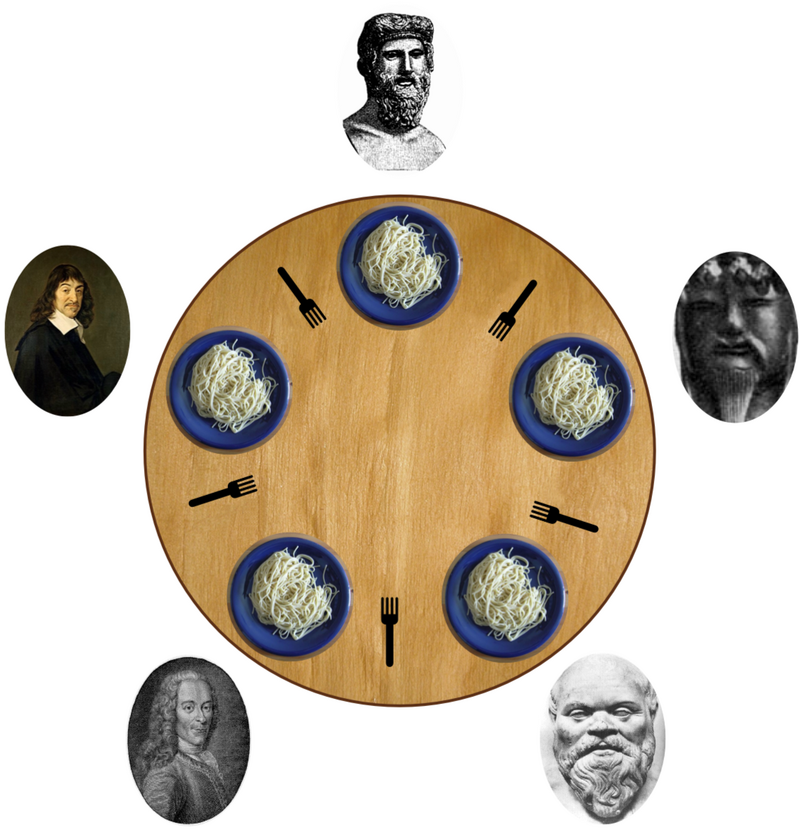

# 42_PHILOSOPHERS



## About

In this project, you will solve the dining philosophers problem, you will delve into the fundamentals of concurrent programming, exploring threading and multiprocessing techniques. Through the simulation of the dining philosophers problem, you'll gain insights into creating threads and employing synchronization primitives such as mutexes and semaphores. By implementing a solution that ensures no philosopher starves, you'll tackle challenges in both multithreading and multiprocessing environments, honing your skills in concurrent programming and synchronization mechanisms.
Here is the link to the [subject](https://cdn.intra.42.fr/pdf/pdf/73397/en.subject.pdf)

## What I learned from this project:

During the development of this project, I've learned several important concepts including:

- **Multithreading**: Understanding how to create and manage multiple threads concurrently, allowing for parallel execution of tasks within a single process.
- **Multiprocessing**: Exploring the creation and coordination of multiple processes, enabling parallel execution of tasks across multiple independent processes, often utilized for maximizing system resources and performance.
- **Data Race**: Recognizing the occurrence of conflicts between concurrent threads or processes accessing shared data without proper synchronization, leading to unpredictable behavior and potential program crashes.
- **Starvation**: Understanding the phenomenon where a thread or process is unable to proceed with its execution due to being perpetually denied access to a critical resource, often caused by unfair scheduling or resource allocation.
- **Race Condition**: Identifying the scenario where the outcome of a program depends on the relative timing or interleaving of operations from concurrent threads or processes, resulting in unpredictable behavior and incorrect program execution.

# my_42_project


## Usage

1. Clone the repository to your local machine:

   ```bash
   git clone git@github.com:Stilram19/fractal.git
   ```

2. Navigate to the repository's directory:

    ```bash
    cd fractal
    ```

3. Compile and Run the program:

    For Mandatory (Multithreading):

   ``` bash
   cd philo && make && ./philo 5 500 100 100
   ```

    For Bonus (Multiprocessing):

    ``` bash
   cd philo_bonus && make && ./philo_bonus 5 500 100 100
   ```
## Concepts you cannot do without (for students):

- [image memory representation](https://youtu.be/8CuYq3RU7BY?si=4uNmKBcBs7NfgL5R)
- [RGB coloring model](https://en.wikipedia.org/wiki/RGB_color_model)
- [fractal](https://en.wikipedia.org/wiki/Fractal)
- [Basics of Complex Numbers](https://en.wikipedia.org/wiki/Complex_number)
- [Mandelbrot Set](https://en.wikipedia.org/wiki/Mandelbrot_set)
- [Julia Set](https://en.wikipedia.org/wiki/Julia_set)
- [Julia Set](https://en.wikipedia.org/wiki/Julia_set)
- [Computer Graphics](https://en.wikipedia.org/wiki/Computer_graphics_(computer_science))